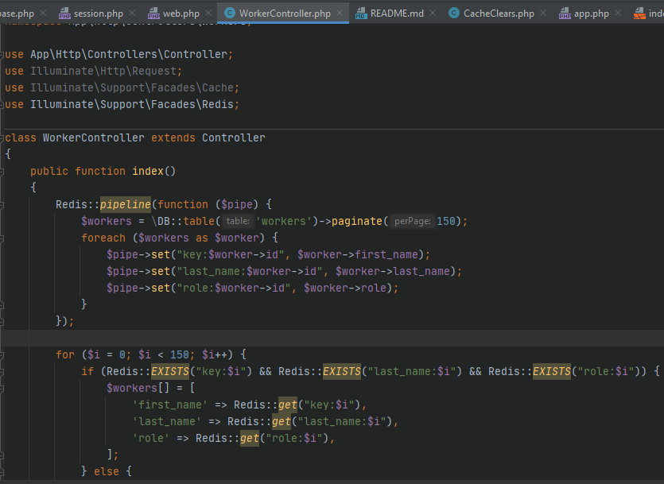
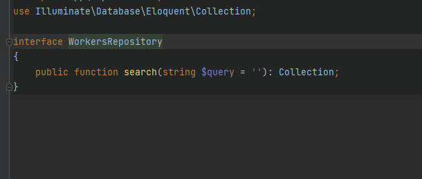
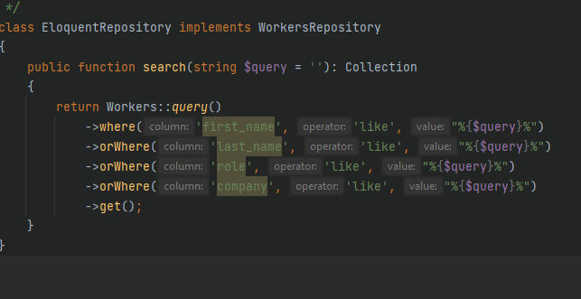

17 Задание 
1. Скорректируйте реализованную фильтрацию и поиск данных в своем проекте на ElasticSearch.
2. Занесите в ElasticSearch минимум одну сущность проекта.

Установил elasticssearch подключил к своему приложению через composer командой
composer require elasticsearch/elasticsearch

Создал вид для выода поля поиска и всех работников

Сделал директрию repositories в ней создал интерфейс WorkersRepository с методом search

Создал репозиторий поиска средствами Eloquent с названием EloquentRepository
который имплементирует интерфейс WorkersRepository

Зарегистрировал EloquentRepository в AppServiceProvider
По такому же приципу сделал ElasticSearchRepository
Создал консольную команду индексации бд
search:reindex

