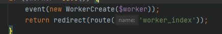
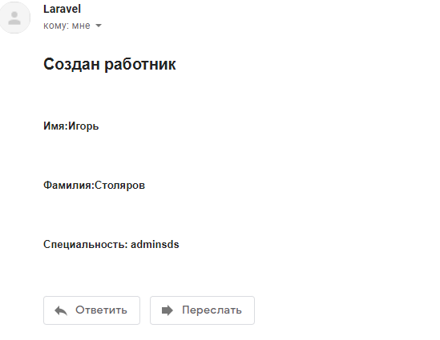
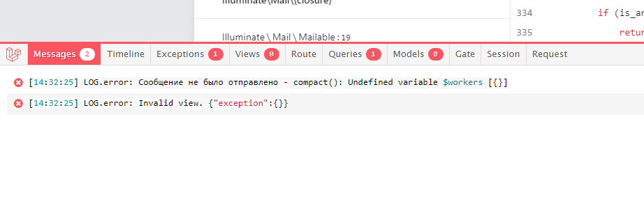
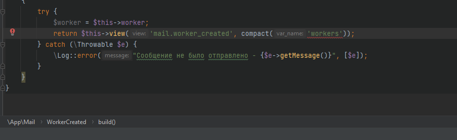

18 Задание 
1. Настройте отправку email-письма пользователю при каком-либо событии (регистрация,
   создание новости, оформление подписки на рассылку и т.д.).
2. Для этого создайте событие и слушателя или подписчика на события и зарегистрируйте их в
   EventServiceProvider.
3. Создайте шаблон письма и укажите в нем имя пользователя.
4. Оберните блок кода отправки сообщения в конструкцию try-catch, в блоке catch пропишите
   логирование, используйте заведомо некорректные данные при отправке сообщения для
   тестирования логирования.

Создал событие WorkerCreate командой 
php artisan make:event WorkerCreate
и привязал к нему слушатель WorkerEmailListener командой 
php artisan make:listener WorkerEmailListener --event=WokerCreate
Само событие находится в контроллере WorkerController

Событие привязал к созданию нового рабочего в бд workers
Настроил отправку почты через яндекс smtp 

Обернул try catch отправку почты при ошибке данные записываются в лог

