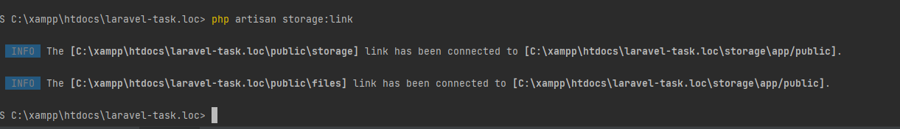
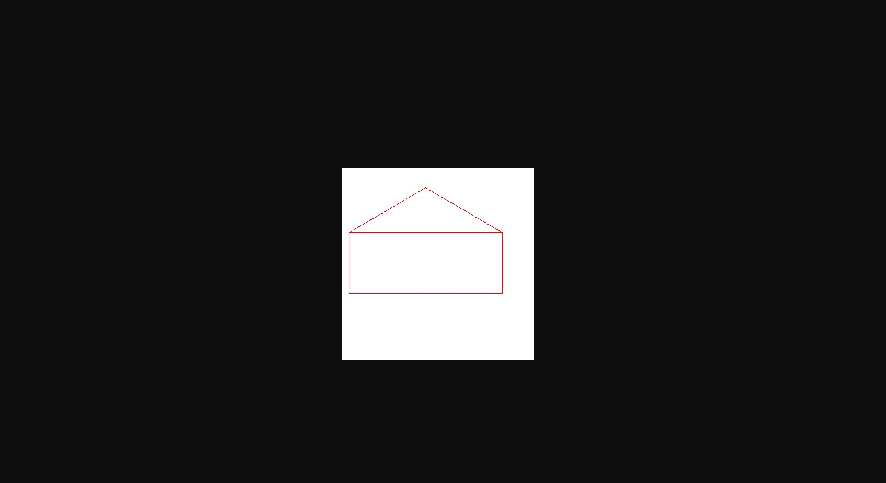

19 Задание 
1. При помощи консольных команд создайте символьную ссылку
2. Напишите методы, которые позволят, например, получить содержимое файла; определить
   существование файла; скачать файл
3. Реализуйте сохранение файлов на разные диски. Например, новости сохраняются на диск news, а
   посты на диск posts
4. Установите пакет Intervention Image и реализуйте обработку изображений, например, аватары,
   загружаемые пользователем, должны сохраняться с разрешением не больше 100x100
5. Творческое задание. Используя возможности Intervention Image нарисуйте простое изображение

_____________________________________________________________________________________________
1. Создал символьные ссылки к разным дискам

2. Сделал контроллер файлов FileController там прописал методы сохранения удаления и скачки
3. Так же в контроллере с помощью Intervention Image преобразую загруженные картинки в размер 100Х100
и сохраняю в созданом локальном диске files.
4. Написал новый роут к 5-му заданию и в методе нарисовал домик или конверт)) так и не понял по 
5. 
