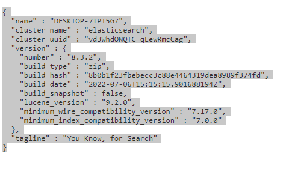

16 Задание 
1. Обернуть запросы в базу данных в кэш, используя обычный и тегированный кэши.
2. Написать Artisan-команду, которая периодически очищает кэш.

Установил редис подключил к своему приложению через composer
У становил клиент для доступа к БД Redis

Создал контроллер вывода работников на странице

В методе index сохраняю в кэш Redis поля и добавил сохранение тегированого кеша
Создал консольную команду очистки кеша 

